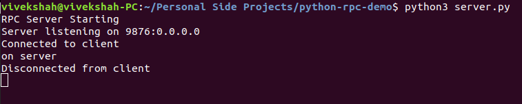
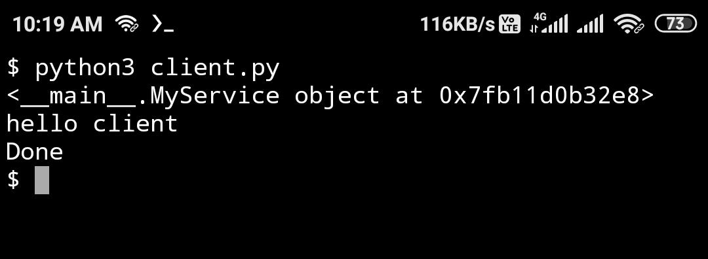

# Python RPC Demo
## Demonstrating Remote procedure calls over RPC using RpyC

# Installation

#### On server
- `pip3 install -r requirements.txt`
- `python3 server.py`

#### On Client
- `pip3 install -r requirements.txt`
- `python3 client.py`

# Screenshots

### On the laptop

### On phone, using termux
##### Calling the procedure over PRC.

